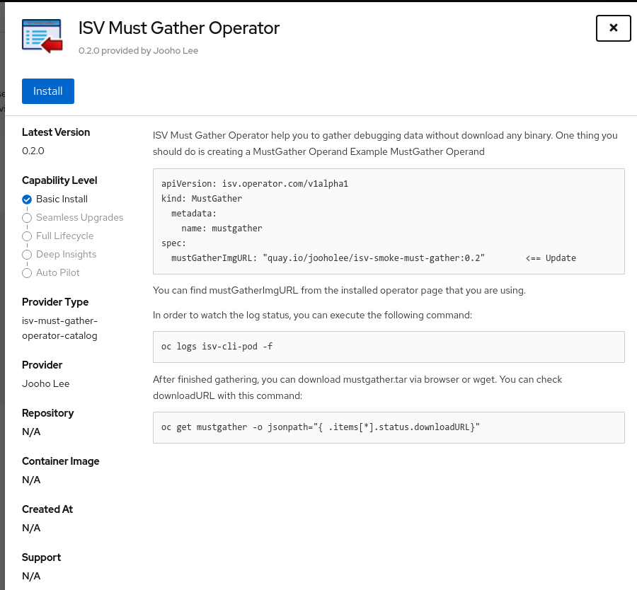
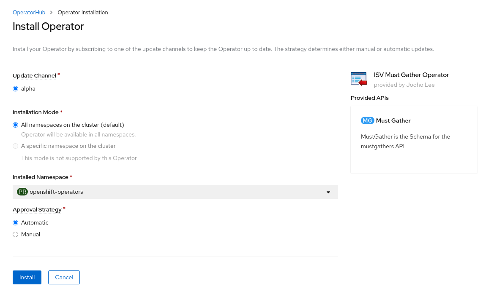
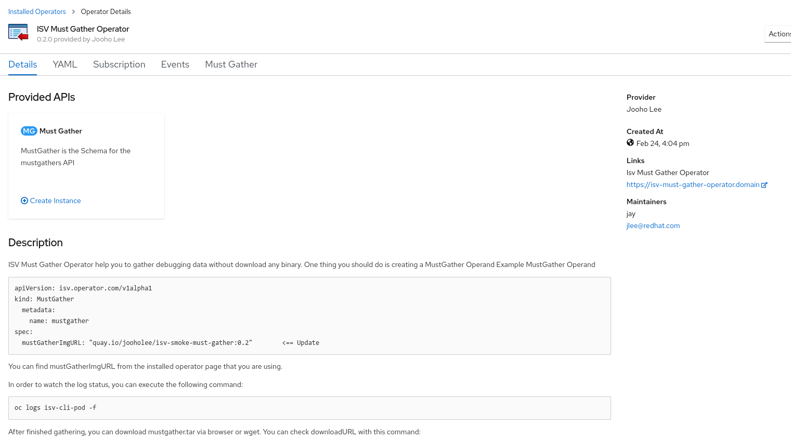

# ISV Must-Gather Operator Demo

## Environment
- [OpenShift 4.6 on openstack](https://console-openshift-console.apps.bell.tamlab.brq.redhat.com/)
- [NFS Provisioner Operator](https://github.com/Jooho/nfs-provisioner-operator)
- [Local Storage Operator](https://docs.openshift.com/container-platform/4.5/storage/persistent_storage/persistent-storage-local.html#local-storage-install_persistent-storage-local)
- PerceptiLabs Operator 1.0.21
  
## Pre-requisites [Appendix 1](#appendix-1)
- Attach storage(100G) to [worker nodes](https://10.37.197.10/dashboard/project/instances/2f9e01da-19ec-42b1-9299-999318caf243/)
- Install local storage operator and create LocalVolume CR - [OpenShift Console](https://console-openshift-console.apps.bell.tamlab.brq.redhat.com/)
- Create ISV Must-Gather Operator CatalogSource

## Flows
- *Sue*(End-User) create a project `test-sue`
- *Joe* (OSD admin/cluster-admin) deploy ISV Must-Gather Operator via OpenShift Console.
- *Joe* deploy PerceptiLabs Operator via OpenShift Console in `test-sue` for *Sue*(end-user)
- *Sue* create **PerceptiLabs CR** in `test-sue`
- Suppose PerceptiLabs have some issues.
- *Sue* goes to Installed Operator menu in Console and find MUST-GATHER Image url from the Perceptilab Operator Page.
- *Sue* Create `MustGather CR` downloaded tarball via route.

## Step by step

### Create a project
*Sue*(End-User) create a project `test-sue`
~~~
oc new-project test-sue
~~~

### Deploy ISV Must-Gather Operator via OpenShift Console
*Joe* (OSD admin/cluster-admin) deploy ISV Must-Gather Operator via OpenShift Console.

  
  
  
  

- Check if who can create mustgather
~~~
oc policy who-can create mustgather -n test-sue
~~~
[OperatorGroup](https://docs.openshift.com/container-platform/4.7/operators/understanding/olm/olm-understanding-operatorgroups.html) create clusterrole (admin,view,edit)

### Deploy PerceptiLabs Operator via Openshift Console
*Joe* deploy PerceptiLabs Operator via OpenShift Console in `test-sue` for *Sue*(end-user)

### Create a PerceptiLabs CR 
*Sue* create **PerceptiLabs CR** in `test-sue`

- Create a PVC first
~~~
echo "
kind: PersistentVolumeClaim
apiVersion: v1
metadata:
  name: perceptilabs-pvc
  namespace: test-sue
spec:
  storageClassName: nfs
  volumeMode: Filesystem
  accessModes:
    - ReadWriteOnce
  resources:
    requests:
      storage: 50Gi"|oc create -f -
~~~

- Create a PerceptiLabs CR
~~~
echo "
apiVersion: perceptilabs.com/v1
kind: PerceptiLabs
metadata:
  name: example-perceptilabs
  namespace: test-sue
spec:
  corePvc: perceptilabs-pvc
  ryggPvc: perceptilabs-pvc
  coreGpus: 0
  license_name: demo
  license_value: demo"|oc create -f -
~~~

- Check Route 
~~~
oc get route perceptilabs-frontend -o jsonpath='{.spec.host}'
~~~

### Gather Data
- Suppose PerceptiLabs have some issues.
- *Sue* goes to Installed Operator menu in Console and find MUST-GATHER Image url from the Perceptilab Operator Page. (TBD)

- *Sue* Create `MustGather CR`
~~~
echo "apiVersion: isv.operator.com/v1alpha1
kind: MustGather
metadata:
  name: percepilabs-mustgather
spec: 
  mustGatherImgURL: \"quay.io/jooholee/isv-smoke-must-gather:0.2.0\""|oc create -f -
~~~

- Check pods
~~~
NAME                                     READY   STATUS    RESTARTS   AGE
isv-cli-pod                              1/1     Running   0          45s
must-gather-wqc29                        2/2     Running   0          35s
perceptilabs-core-5b4d9bd775-zz2ws       1/1     Running   0          5m50s
perceptilabs-frontend-79d5bbcc9f-gl8lx   1/1     Running   0          5m48s
perceptilabs-operator-844ffbb7dd-g5tn9   2/2     Running   0          54m
perceptilabs-rygg-6f557f8b5c-b5hqr       1/1     Running   0          5m52s
~~~
- *Sue* find a URL to download mustgather.tar 
~~~
oc logs -f isv-cli-pod
....
[must-gather-wqc29] OUT downloading gather output
WARNING: rsync command not found in path. Please use your package manager to install it.
[must-gather-wqc29] OUT ./must-gather.tar
[must-gather-wqc29] OUT ./events.yaml
[must-gather-wqc29] OUT Teardown must-gather pod
Creating Event Filter Page
Adding event-filter-page to must-gather.tar file
Webserver start
Please check your MustGather CR to know the download url using the following command
-----------------------------------------------------------------------
oc get mustgather -o jsonpath="{ .items[*].status.downloadURL}"
~~~
- Get the URL from the following cmd.
~~~
oc get mustgather -o jsonpath="{ .items[*].status.downloadURL}"
http://isv-cli-route-test-sue.apps.bell.tamlab.brq.redhat.com/download
~~~

- Copy the url to browser or download the file with wget
~~~
wget http://isv-cli-route-test-sue.apps.bell.tamlab.brq.redhat.com/download
~~~

### Clean
~~~
oc delete perceptilabs example-perceptilabs -n test-sue
oc delete operatorgroups --all -n test-sue
oc delete subscriptions perceptilabs-operator-package -n test-sue
oc delete pvc perceptilabs-pvc
oc delete mustgather --all -n test-sue
oc delete subscription isv-must-gather-operator -n openshift-operators
oc delete catalogsource isv-must-gather-operator-catalog -n openshift-marketplace

for i in $(oc get csvs  --all-namespaces|grep isv-must |awk '{print $1}');do oc delete csvs isv-must-gather-operator.v0.2.0 -n $i ;done
oc delete crd mustgathers.isv.operator.com

oc delete project test-sue test-peter

oc get pod --all-namespaces --template='{{ range $pod := .items}}{{if ne $pod.status.phase "Running"}} oc delete pod -n {{$pod.metadata.namespace}} {{$pod.metadata.name}} {{"\n"}}{{end}}{{end}}'  |bash -

for im in $(docker images|grep '\<none' |awk '{print $3}'); do docker rmi --force $im;done

~~~

## Reference
- [ISV CLI Git](https://github.com/Jooho/isv-cli)
- [ISV Must-Gather Operator Git](https://github.com/Jooho/isv-must-gather-operator)
- [ISV Smoke Must-Gather](https://github.com/Jooho/isv-smoke-must-gather)
- [NFS Provisioner Operator Must Gather Git](https://github.com/Jooho/nfs-provisioner-operator/tree/main/must-gather)
- 
  

## Appendix
### Appendix 1
- Install local storage operator and create LocalVolume CR 
~~~
export productVerion=4.6
echo "
apiVersion: v1
kind: Namespace
metadata:
  name: openshift-local-storage
---
apiVersion: operators.coreos.com/v1alpha2
kind: OperatorGroup
metadata:
  name: openshift-local-operator-group
  namespace: openshift-local-storage
spec:
  targetNamespaces:
    - openshift-local-storage
---
apiVersion: operators.coreos.com/v1alpha1
kind: Subscription
metadata:
  name: local-storage-operator
  namespace: openshift-local-storage
spec:
  channel: \"${productVersion}\" 
  installPlanApproval: Automatic
  name: local-storage-operator
  source: redhat-operators
  sourceNamespace: openshift-marketplace" |oc create -f -

oc project openshift-local-storage

echo "
apiVersion: \"local.storage.openshift.io/v1\"
kind: \"LocalVolume\"
metadata:
  name: \"local-disks\"
  namespace: \"openshift-local-storage\" 
spec:
  nodeSelector: 
    nodeSelectorTerms:
    - matchExpressions:
        - key: kubernetes.io/hostname
          operator: In
          values:
          - worker-0.bell.tamlab.brq.redhat.com
          - worker-1.bell.tamlab.brq.redhat.com
          - worker-2.bell.tamlab.brq.redhat.com
  storageClassDevices:
    - storageClassName: \"local-sc\"
      volumeMode: Filesystem 
      fsType: xfs 
      devicePaths: 
        - /dev/vdb" | oc create -f -
~~~

- Create nfs-provisioner CatalogSource
~~~
cat <<EOF | oc apply -f -
apiVersion: operators.coreos.com/v1alpha1
kind: CatalogSource
metadata:
  name: nfsprovisioner-catalog
  namespace: openshift-marketplace
spec:
  sourceType: grpc
  image: quay.io/jooholee/nfs-provisioner-operator-index:0.0.1 
EOF
~~~
- Install NFS Provisioner Operator via OpenShift console
~~~
oc new-project nfs-provisioner

cat <<EOF | oc apply -f -
apiVersion: operators.coreos.com/v1
kind: OperatorGroup
metadata:
  name: nfs-provisioner-9mrzq
  namespace: nfs-provisioner
spec:
  targetNamespaces:
  - nfs-provisioner
EOF

cat <<EOF | oc apply -f -
kind: Subscription
metadata:
  name: nfs-provisioner-operator
  namespace: nfs-provisioner
spec:
  channel: alpha
  installPlanApproval: Automatic
  name: nfs-provisioner-operator
  source: nfsprovisioner-catalog
  sourceNamespace: openshift-marketplace
  startingCSV: nfs-provisioner-operator.v0.0.1
EOF
~~~

- Create NFSProvisioner
~~~
  
echo "
apiVersion: cache.jhouse.com/v1alpha1
kind: NFSProvisioner
metadata:
  name: nfsprovisioner-sample
  namespace: nfs-provisioner
spec:
  storageSize: \"80G\"
  scForNFSPvc: local-sc
  SCForNFSProvisioner: nfs"|oc create -f -
~~~

- Create ISV Must-Gather Operator catalogsource
~~~
echo "
apiVersion: operators.coreos.com/v1alpha1 
kind: CatalogSource 
metadata: 
  name: isv-must-gather-operator-catalog 
  namespace: openshift-marketplace 
spec: 
  sourceType: grpc 
  image: quay.io/jooholee/isv-must-gather-operator-index:0.2.0" | oc create -f - 
~~~

Tip) When operator install, olm create 
~~~
mustgathers.isv.operator.com-v1alpha1-admin                                 2021-02-26T02:56:47Z
mustgathers.isv.operator.com-v1alpha1-crdview                               2021-02-26T02:56:47Z
mustgathers.isv.operator.com-v1alpha1-edit                                  2021-02-26T02:56:47Z
mustgathers.isv.operator.com-v1alpha1-view                                  2021-02-26T02:56:47Z
~~~