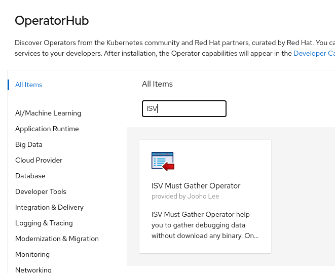
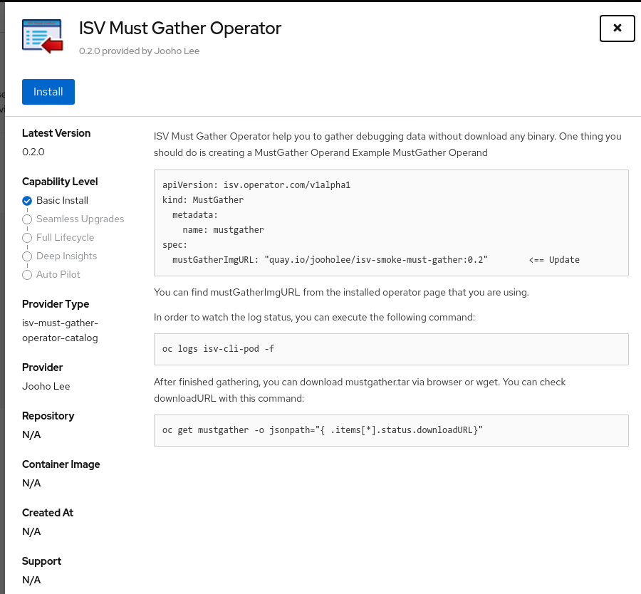
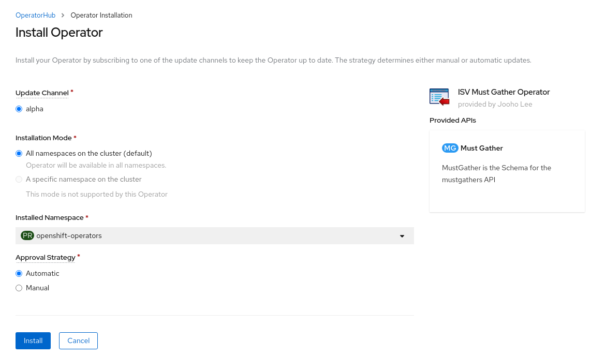
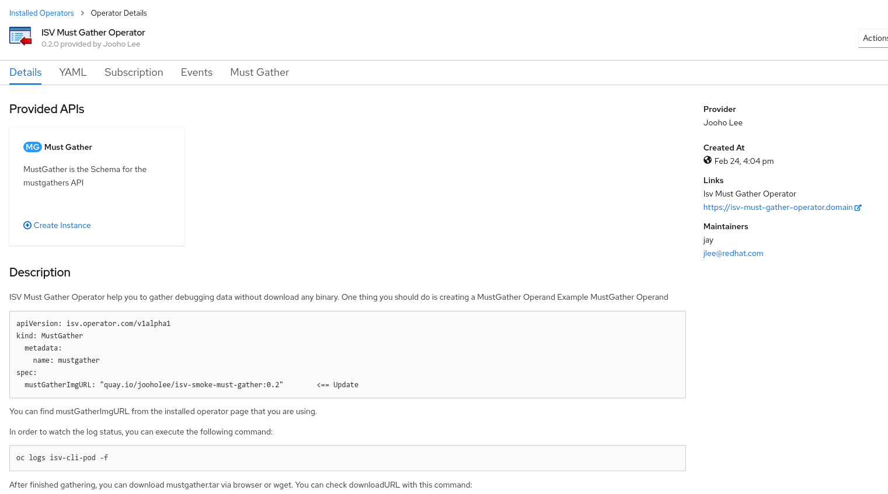

# How to use ISV Must Gather Operator

## Flow
- Deploy CatalogSource
- Install ISV Must-Gather Operator via OpenShift Console
- Create MustGather CR

## Steps
### Deploy CatalogSource
- Using isv-must-gather-operator git repository
  ~~~
  git clone https://github.com/Jooho/isv-must-gather-operator.git

  cd isv-must-gather-operator

  # Login an OpenShift Cluster with cluster admin user
  oc login 

  make cs-deploy
  ~~~
- Creating CatatlogSource object directly
  ~~~
  echo "
  apiVersion: operators.coreos.com/v1alpha1 
  kind: CatalogSource 
  metadata: 
    name: isv-must-gather-operator-catalog 
    namespace: openshift-marketplace 
  spec: 
    sourceType: grpc 
    image: quay.io/jooholee/isv-must-gather-operator:latest" | oc create -f -  
  ~~~

### Install ISV Must-Gather Operator via OpenShift Console
  
  
  
  

### Create MustGather CR
- Using isv-must-gather-operator git repository
  ~~~
  # Login an OpenShift Cluster with admin user
  oc login
  oc new-project test

  make cr-deploy
  ~~~
- Creating CatatlogSource object directly
  ~~~
  echo "apiVersion: isv.operator.com/v1alpha1
  kind: MustGather
  metadata:
    name: mustgather-test
  spec: 
    mustGatherImgURL: \"quay.io/jooholee/isv-smoke-must-gather:0.2.0\""|o create -f -
  ~~~
